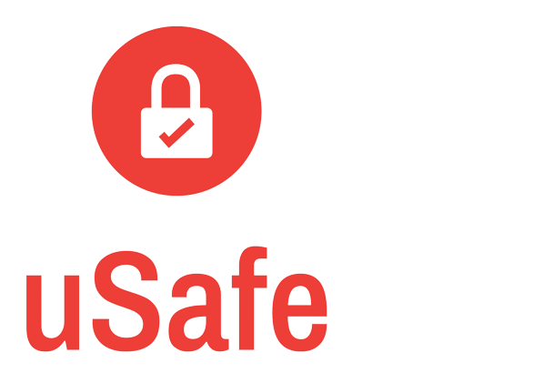

# 
uSafe este un sistem dezvoltat pentru facilitarea comunicării dintre autoritățile statului și persoanele aflate în pericol. Acest sistem a fost dezvoltat prin 2 platforme: mobil și web, oferind suport și pentru persoanele cu deficiențe de auz și de vorbire.

## Cerințe necesare pentru rulare

Pentru a seta proiectul pe calculatorul personal sunt necesari următorii pași de instalare.

* Python v.3.10.10
* Pip v.23.1.2
* TensorFlow v.2.10.0
* MediaPipe v.0.9.0.1
* ScikitLearn v.1.2.2
* Keras v.2.10.0
* Matplotlib v.3.7.1
* OpenCv v.4.7.0.72
* Node js v.16.18.0
* Npm v.8.19.2
* PostgreSQL 1v.5.3
* PgAdmin
* Xcode v.14.3
* AndroidStudio v.2021.3.1
* Opțional: cuda și cuDNN - versiunile aferente driverul-ui plăcii video a calculatorului (nVidia)

Pentru a rula proiectul pe calculatorul personal sunt necesari următorii pași:

* Clonare repository de pe [github](https://github.com/ioanarijnita/uSafe)
* Deschidere foldere de backend, web, respectiv mobile într-un IDE și rulare comandă „npm install”
* Pentru aplicația mobilă, este necesară rularea unui build în programele Xcode/AndroidStudio în funcție de sistemul de operare al telefonului
* Pornire aplicație pe backend, web, respectiv mobile prin rularea comenzii „npm start”
